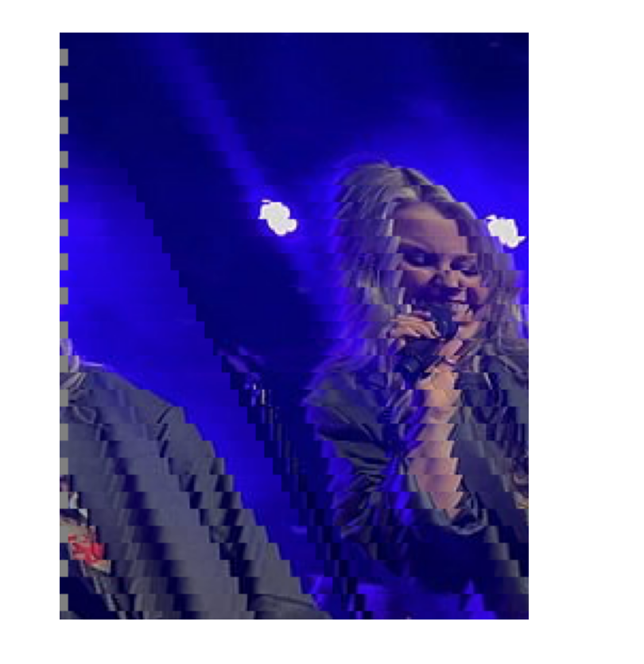

# JPEG Decoder

This project implements a decoder for JPEG JFIF images.
Sub-sampling was not handled, nor were images where multiple Huffman 
tables were defined in a single DHT section, or where multiple quantisation tables
were defined in a single DQT section.

To get started, open the project with an IDE that supports CMake, and change the image path in the main file.
(python3 may need to be switched to python line 23 in main).

## Algorithm Description

First, the different sections containing all the information for image decompression are read. 
In order to facilitate debugging, information is not read once, byte by byte, but multiple times.

Then, we decode the fundamental harmonic with RLE (Run-Length Encoding) and decode the end of the signal magnitude. Then, we apply Huffman decoding (using two different types of tables) to decode the complete signal.

Frequential signals are transformed by inverse quantisation and inverse cosinus transform to spatial YCbCr data.

Since our eyes are more sensitive to luminance variation, the image is stored in the YCbCr format, and the Cb and Cr blocks are usually sub-sampled.

The JFIF format allows four types of compression:

- Horizontal compression, stored as Y1Y2CbCr
- Vertical compression, stored as Y1Y2CbCr
- Quadra compression, stored as Y1Y2Y3Y4CbCr
- No compression, stored as YCbCr. Only this case was implemented.

With sub-sampling, after decoding all the signals, we'd have to upscale the chrominance blocks,
and correctly place pixels in the right location of the image.

Finally, YCbCr values are converted to RGB values.

In order to quickly assess the results, displaying images is handled by the display.py Python script.

## Difficulties

### Unused Information
Some blocks are not used at the end of the file, causing some images (not all) to be incorrectly decompressed.

### Size
We have to pay attention to whether the size of the image is a multiple of 8.

### Error Propagation
Because the fundamental frequency is encoded by difference, if we fail to decode one part correctly, we may fail to decode the whole image.

## Example of Images

First decompression: The loop was not well calibrated, causing these grey bands.

Second decompression: The fundamental frequency was not well decoded, causing this.

Third decompression: We did not find a way to correct this.

Here, the image's size is not a multiple of 8, causing this shift.

Once it is corrected:

One last image:

## Summary of results with provided example images

All following mentioned images are not sub-sampled and use one DQT or DHT section per quantisation table or 
Huffman table.

- Our implementation doesn't work with: francois.jpg, pedro.jpg, sch.jpeg.

- Our implementation works perfectly with chappell.jpeg, manon.jpg, nicolas.jpg, pick.jpeg, renee.jpg and test.jpeg.